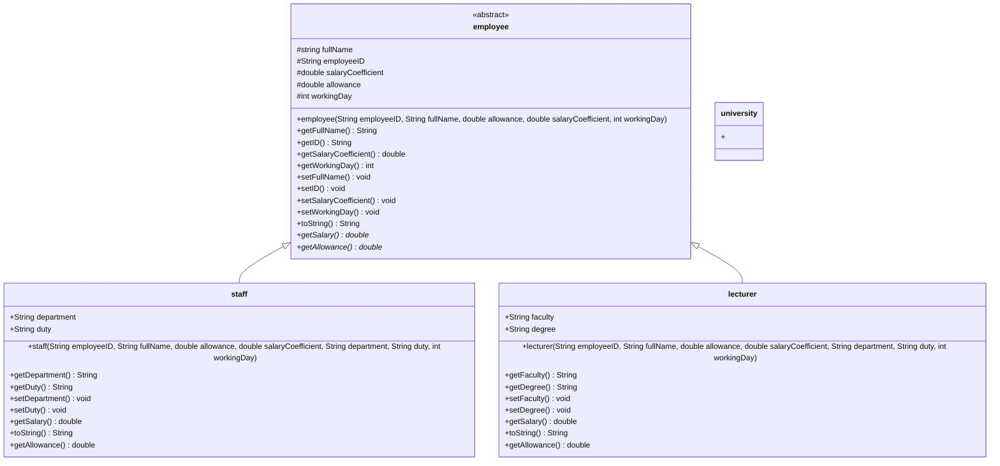

# Program to manage information of Staff and Lecturer
* [Details requirement and Deadline](https://docs.google.com/document/d/1DuYoXo2PoY21FHdF_kSY2StseaumAAp9/edit) (Note: Use student's gmail with `@student.tdtu.edu.vn` extension)

<h1> Summary </h1>
    <h3> I have a monthly assignment from my Lecturer is help my university to manage      informations of its Lecturer and Staff as the table below </h3>
    <table , style="text-align: center; vertical-align: middle;">
        <tr>
            <th bgcolor= "lightgray"> Lecturer </th>
            <th bgcolor= "lightgray"> Staff </th>
        </tr>
        <tr>
            <td> Full Name </td> 
            <td> Full Name  </td>
        </tr>
        <tr>
            <td> Faculty </td>
            <td> Department </td>
        </tr>
        <tr>
            <td> Number of teaching day </td>
            <td> Number of workding day </td>
        </tr>
        <tr>
            <td> Salary coefficient </td>
            <td> Salary coefficient </td>
        </tr>
        <tr>
            <td> Allowance </td>
            <td> Allowance </td>
        </tr>
        <tr>
            <td> Degree </td>
            <td> Duty  </td>
        </tr>
    </table>
    <h3> Allowance of employee can compute as </h3>
        <table , style="text-align: center; vertical-align: middle;">
            <tr>
                <th bgcolor= "lightgray"> Degree </th>
                <th bgcolor= "lightgray"> Allowance </th>
            </tr>
            <tr>
                <td> Bachelor </td>
                <td> 300 </td>
            </tr>
            <tr>
                <td> Maater </td>
                <td> 500 </td>
            </tr>
            <tr>
                <td> Doctor </td>
                <td> 1000 </td>
            </tr>
            <tr>
                <th bgcolor= "lightgray"> Duty </th>
                <th bgcolor= "lightgray"> Allowance </th>
            </tr>
            <tr>
                <td> Head of Department </td>
                <td> 1500 </td>
            </tr>
            <tr>
                <td> Deputy Head of Department </td>
                <td> 1000 </td>
            </tr>
            <tr>
                <td> Employee </td>
                <td> 500 </td>
            </tr>
        </table>        
    <h3> Lecturer's salary can compute by below equation </h3>
        <pre> salary = Salary coefficient * 830 + allowance + Number of teaching day * 30 </pre> 
    <h3> Staff's salary can compute by below equation </h3>
        <pre> salary = Salary coefficient * 830 + allowance + Number of working day * 50 </pre>   
    <h3> Features </h3>
        <ul>
            <li> Nhập danh sách các cán bộ trong trường </li> 
            <li> Xuất danh sách giảng viên khoa CNTT </li> 
            <li> In lương của nhân viên hành chính thuộc khoa CNTT có tên là “Khai” </li> 
            <li> Tìm thông tin các bộ có lương cao nhất trường </li> 
            <li> Tăng hệ số lương cho cán bộ của toàn trường thêm 0.1 và xuất kết quả </li> 
            <li> Tính tổng số lương phải trả cho cán bộ, giảng viên </li> 
            <li> Lọc cán bộ, giảng viên có lương trên 15tr </li> 
            <li> Sắp xếp lương của cán bộ và giảng viên theo thứ tự giảm dần </li> 
            <li> Thêm, xóa sửa và thao tác với File dữ liệu chứa thông tin của cán bộ và giảng viên </li> 
            <li> Chưa nghĩ ra :) </li> 
            <li> Chưa nghĩ ra :) </li>
        </ul>
        

