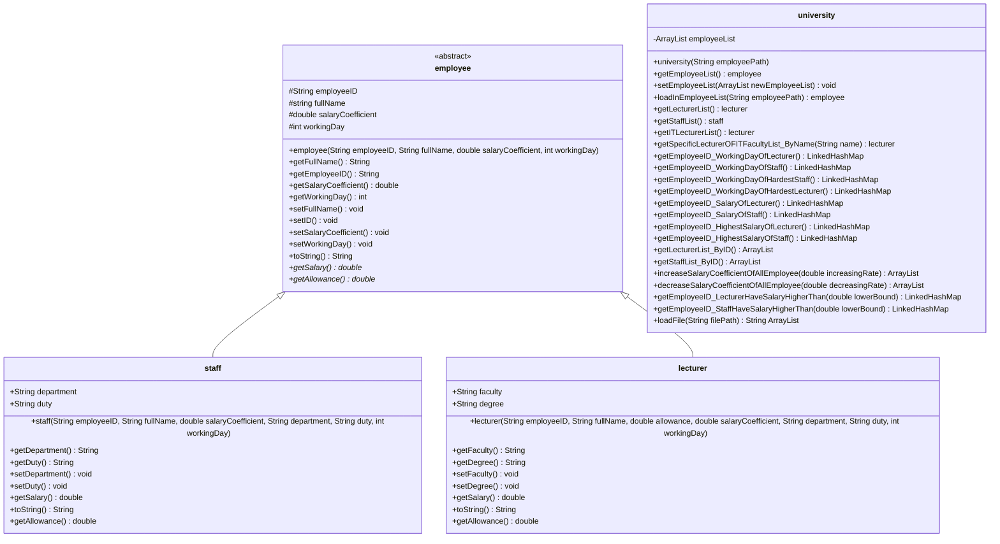

# Program to manage information of Staff and Lecturer
* [Details requirement and Deadline](https://docs.google.com/document/d/1DuYoXo2PoY21FHdF_kSY2StseaumAAp9/edit) (Note: Use student's gmail with `@student.tdtu.edu.vn` extension)
* [Github]: https://github.com/loveCiForever/UniversityManagementInJava

        

